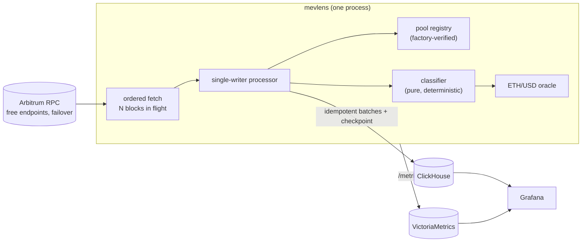

# MEVLens — Arbitrum Arbitrage Observatory

A Go service that watches every block on Arbitrum One, detects atomic arbitrage on
canonical Uniswap v2/v3/v4-style pools, and records who won, how much they made and how
much they paid for transaction ordering, in ClickHouse, with Grafana dashboards.

> **Status: Phase 0 (observatory).** MEVLens is a research tool. It only reads
> the chain: it holds no keys and sends no transactions. The longer-term design
> adds a deterministic shadow engine on top of the same core.

## Why

In September 2026 Arbitrum One replaced Timeboost (express-lane auctions) with
per-transaction **Priority Gas Auctions**: 250 ms blocks split into 125 ms
rounds, ordered by priority fee. Under PGA the ordering bid of every winner is
visible on-chain, so you can measure competition directly. As of this writing no
public dataset describes arbitrage on Arbitrum after the switch. MEVLens builds one.

What it measures, per block and per arbitrage:

- successful atomic arbitrages and **reverted attempts** by known bot contracts
  (a lost race still lands on-chain and pays gas)
- gross profit in the profit token, valued in ETH where possible
- gas cost, **priority fee per gas** (the bid) and the **bid share** of profit
- hops, pools, venues, sender and executing contract
- Timeboost-flagged transactions, to locate the regime boundary from data

A first smoke run on mainnet (about 1,200 blocks, October 2026) found arbitrages
whose priority fee consumed **27% and 56%** of gross profit. That is one small
sample, not a study; the dashboards exist to produce the study.

## Architecture



Key decisions (each one is an ADR in [`docs/adr`](docs/adr)):

| Decision | Why |
|---|---|
| [Read-only, non-commercial observatory first](docs/adr/0001-observatory-first.md) | Measure the market before building anything that trades |
| [Deterministic single-writer core, ports & adapters](docs/adr/0002-deterministic-core.md) | Concurrent fetching, but one goroutine owns all state, so replays and golden tests are exact. The core never depends on infrastructure, even transitively; a lint rule and an architecture test enforce it |
| [Minimal Arbitrum-aware JSON-RPC client](docs/adr/0003-json-rpc-client.md) | Upstream go-ethereum cannot decode Arbitrum transaction types. The client batches, rate-limits per endpoint, retries only failed requests, and learns which free endpoints lack which methods |
| [Pool-side netting classifier](docs/adr/0004-netting-classifier.md) | Detection doesn't depend on guessing the beneficiary, so routers and profit forwarding don't fool it |
| [Canonical pools via factory lookup](docs/adr/0005-canonical-pools.md) | Any contract can emit a fake `Swap` log. A pool counts only if its factory maps its tokens back to it |
| [ClickHouse ReplacingMergeTree + rewind](docs/adr/0006-storage.md) | At-least-once delivery without duplicates. A reorg deletes the abandoned fork instead of filtering it forever |
| [Uniswap v4](docs/adr/0007-uniswap-v4.md) | 32-byte pool ids, v4's opposite sign convention, a persisted `Initialize` index, and native ETH netted as WETH. All verified on mainnet |

## Quick start

Requirements: Go 1.27+, Docker.

```bash
# 1. No database needed: classify the latest block straight from public RPC
make inspect

# 2. Full stack: ClickHouse + VictoriaMetrics + Grafana
export CLICKHOUSE_PASSWORD='choose-one' GRAFANA_ADMIN_PASSWORD='choose-one'
make up
make follow            # ingest new blocks; Ctrl-C flushes and checkpoints
open http://localhost:3000   # dashboard: MEVLens → Arbitrum Arbitrage Observatory

# Historical range (resumable: re-running continues from its checkpoint)
CLICKHOUSE_ADDR=127.0.0.1:9000 CLICKHOUSE_USER=mevlens \
  ./bin/mevlens backfill -from 512000000 -to 512100000
```

`mevlens inspect -block N -dump DIR` writes a self-contained fixture (block,
receipts, resolved pools, price seed) for golden tests. Without a database,
`inspect` rebuilds the Uniswap v4 pool index on every run (~20–30 s);
`follow`/`backfill` index once and persist it.

## Configuration

[`configs/arbitrum-one.toml`](configs/arbitrum-one.toml) ships four free public
endpoints, the canonical factories (Uniswap v2/v3, Sushi v2/v3, Camelot v2), the
Uniswap v4 PoolManager and the pricing setup. Every address was verified on-chain. Secrets are referenced
as `${NAME}` and read from the environment. Unknown keys and unset variables are
errors, not silent defaults.

To ingest faster, add a keyed free-tier provider with a higher `rps`. With four
public endpoints at 4 rps each, the observer processes about 6 blocks/s.
Arbitrum produces about 4 blocks/s, so catching up after downtime is slow.
An endpoint whose plan caps the batch size takes its own `max_batch` (dRPC's
free plan refuses batches over 3 requests).

## Data model

| Table / view | Grain |
|---|---|
| `blocks` / `blocks_v` | one row per block (base fee, swaps, arbitrages, timeboosted txs, regime) |
| `swaps` | every swap on a canonical pool (`pool_id`: address for v2/v3, PoolId for v4; `pool`: emitting contract) |
| `arbitrages` / `arbitrages_v` | one row per arbitrage or reverted attempt (`profit_eth` sums every profitable token); the view adds `net_eth`, `bid_share` and hex addresses |
| `pools` / `pools_v` | resolved pool metadata, including non-canonical (rejected) addresses; v4 rows carry `hooks`, `native` and `dynamic_fee` (hook-set fee: `fee_pips` is 0) |
| `checkpoints` | last durable block per job |

Find the Timeboost era from data (to fill `[regime]` in the config):

```sql
SELECT min(number) AS first_timeboosted, max(number) AS last_timeboosted
FROM mevlens.blocks FINAL WHERE timeboosted_txs > 0;
```

## Operations

The admin server (default `127.0.0.1:9464`; keep it private) serves:

- `/metrics`: head lag, block age, fetch/flush latency, RPC round trips per endpoint, arbitrages by status and regime
- `/healthz`, `/readyz` (readiness pings ClickHouse)
- `/debug/pprof/*`, including Go 1.27's `goroutineleak` profile
- `/debug/flightrecorder`: the last seconds of execution trace. A slow fetch or flush also dumps one to disk automatically (`runtime/trace.FlightRecorder`)

## Testing

```bash
make test     # unit + golden tests, offline
make race     # with the race detector
make itest    # ClickHouse integration tests (needs `make up`)
make lint     # golangci-lint v2, including the pure-core depguard rule
make bench
```

- **Golden tests on real blocks.** The fixtures in `internal/classify/testdata` are mainnet blocks. Each expected arbitrage was recomputed by an independent script from raw chain data. One is v3-only (+24,062 USDC base units, matching the executor's ERC-20 transfers). Two route through Uniswap v4, with native ETH netted as WETH. In one of those, the executor's own balances don't change because profit is forwarded elsewhere.
- **Deterministic concurrency tests.** Pipeline tests run under `testing/synctest`: random fetch latencies, reorgs, shutdown flushes. They use fake time and fail on leaked goroutines.
- **Architecture test.** `internal/archtest` fails the build if the core (`eth`, `dex`, `pricing`, `classify`) or the pipeline (`observe`) depends on infrastructure, even indirectly. depguard covers direct imports such as `time`.
- **RPC client.** Tests cover out-of-order batch responses, partial retries, 429 failover, endpoints that lack `eth_call`, and making sure errors never leak API keys.

| Benchmark (amd64) | Result |
|---|---|
| Decode a v3 `Swap` log | ~37 ns/op, 0 allocs |
| Parse an address | ~20 ns/op, 0 allocs |
| Classify a block with a 2-hop arbitrage | ~0.7 µs/op |

## Known limitations

- **Venues not decoded yet:** PancakeSwap v3, Algebra/Camelot v3, Balancer and Curve. Arbitrage with a leg on them is missed or partial. Uniswap v4 is supported ([ADR 0007](docs/adr/0007-uniswap-v4.md)).
- Uniswap v4 hooks that return deltas can make the pool-side amounts differ slightly from what the trader paid. Hooked pools are flagged (`pools.hooks`), not excluded.
- Profit is valued in ETH only when the profit token is WETH or a configured USD stablecoin. The dashboard reports valuation coverage.
- Reverted attempts are attributed only to contracts that previously completed a detected arbitrage.
- Backfilling is block-by-block (receipts). A logs-first backfill mode would make multi-week history cheap on free endpoints.

## Layout

```
cmd/mevlens            CLI: follow, backfill, inspect, migrate
internal/eth           primitives and JSON-RPC wire types (no go-ethereum)
internal/rpc           batched, rate-limited, failover JSON-RPC client
internal/dex           pool identity and Swap/Initialize decoding (v2/v3/v4)
internal/registry      canonical pool verification, v4 Initialize index, cache
internal/pricing       ETH/USD oracle from a reference pool
internal/classify      deterministic arbitrage classifier (the core)
internal/observe       ordered fetch → single-writer processing → sink
internal/store/clickhouse  schema migrations and idempotent sink
internal/telemetry     metrics, admin server, flight recorder
internal/archtest      dependency-rule test on the transitive import graph
deploy/                compose stack, Grafana provisioning, Dockerfile
```

## License

[MIT](LICENSE)
